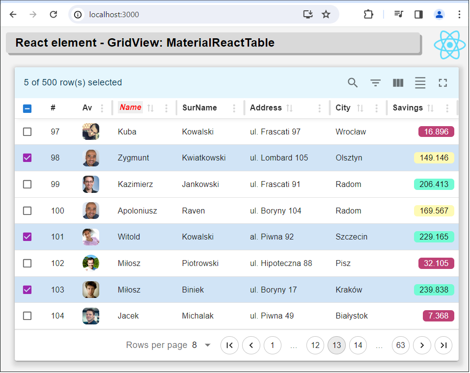
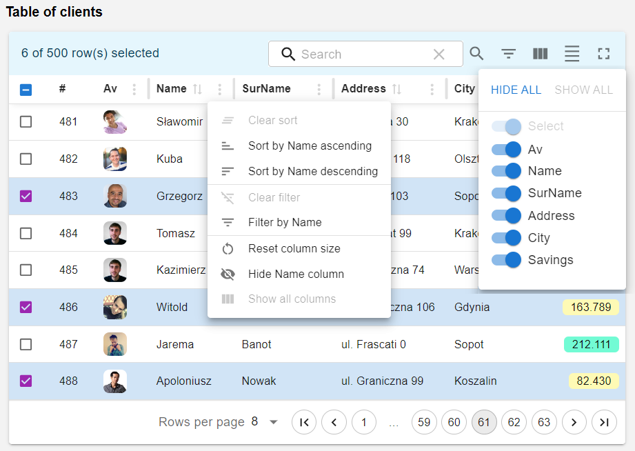

# React element: GridView: MaterialReactTable TS

This page demonstrates using React component - MaterialReactTable: an advanced table for presenting tabular data with columns and rows, such as SQL query results. The component has advanced data display options such as: column configuration, row pagination, sorting, filtering, coloring options, etc. 

- Project React with NPM tools, created by toolkit: create-react-app;
- This project requires instalation libraries by NPM tools, and compilation;
- Project include some files: .html .css .js;
- React main component: "MaterialReactTable" contains advanced table drawing procedures;
- This external component is installed as an npm module;
- You also need to install MUI and Emotion - rich style components associated with the table
- "MaterialReactTable" has great configuration possibilities. The configuration is contained in the config_table.js file;
- Npm instaled local libraries: react v18.2, react-dom v18.2, react-scripts v5.0 with babel-loader v8.3;
- Project written in Visual Studio Code.

.

## Details

The application is initiated by the toolchain [Create React App], which creates files and the application operating environment. The startup script [….\node_modules\react-scripts\scripts\start.js] starts a local web server, embeds the project files (html, css, js) and starts public/index.html along with the compiled js files.
